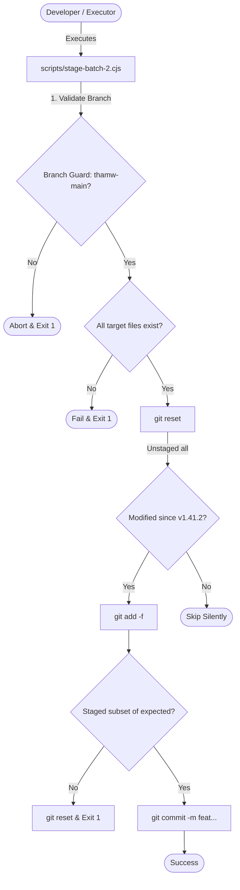

# Phase 37: Stage and Commit Scanner Logic - Research

**Researched:** 2026-05-22
**Domain:** git-refactoring / tooling-automation
**Confidence:** HIGH

## Summary

This phase targets the staging and committing of the Batch 2 files as part of the `v1.41.5` Refactor Git Commit History milestone. The target files are:
1. `hooks/gsd-read-injection-scanner.js` (modified)
2. `scripts/audit-tags.js` (untracked)
3. `hooks/gsd-check-update.js` (modified)

To automate this cleanly and prevent human error, we will construct a Node.js helper script `scripts/stage-batch-2.cjs` (modeled after `scripts/stage-batch-1.cjs`). The automation script will enforce:
- An active branch check guarding against staging on branches other than `thamw-main` (overridable via environment variable `ALLOW_ANY_BRANCH=1`).
- Validation that all three Batch 2 files exist on disk before staging.
- Clean unstaging of any pre-existing staged files (via `git reset`).
- Staging of only modified/added target files (via `git add -f`).
- Strict validation that no unauthorized files are staged.
- ConvCommit message compliance and early exit logic if the batch has already been committed.

**Primary recommendation:** Implement and run the untracked staging script `scripts/stage-batch-2.cjs` to automate checks and stage/commit only the three specified files, keeping the branch clean and verifying the commit message.

## User Constraints

> [!IMPORTANT]
> The following constraints are copied verbatim from `.planning/phases/37-stage-and-commit-scanner-logic/37-CONTEXT.md` and MUST be honored during planning and implementation:

### Implementation Decisions

#### Staging Automation Script
- **D-01:** Create a dedicated node script `scripts/stage-batch-2.cjs` to automate staging, validation, and committing of Batch 2 files (fully consistent with `scripts/stage-batch-1.cjs`).
- **D-02:** Keep the script untracked in the workspace as a development artifact (to be staged and committed later in Batch 5).
- **D-03:** Include an active branch guard in `scripts/stage-batch-2.cjs` that aborts the script if the current branch is not `thamw-main`, unless overridden via an environment variable (e.g., `ALLOW_ANY_BRANCH=1`).

#### Scanner Validation
- **D-04:** Fail the staging process if any of the target files (`hooks/gsd-read-injection-scanner.js`, `scripts/audit-tags.js`, `hooks/gsd-check-update.js`) are completely missing on disk.
- **D-05:** Skip staging silently for any target file that exists but has no modifications/changes since tag `v1.41.2`.
- **D-06:** Defer full validation checks of the scanner logic until the final validation phase (Phase 41) to prevent breaking on intermediate commits.

#### Pre-existing Staged Files Handling
- **D-07:** Automatically run `git reset` to unstage any pre-existing staged changes before staging Batch 2 files (fully consistent with Batch 1 behavior).
- **D-08:** Check the latest commit message and if it matches `feat(scanner): refactor scanner logic and audit scripts (Batch 2)`, exit 0 early to prevent duplicate commits if run repeatedly.

### The Agent's Discretion
None specified. Follow standard Git and CLI utilities conventions.

### Deferred Ideas
None — discussion stayed within phase scope.

## Project Constraints (from CLAUDE.md)

- **Test Framework:** Use the built-in Node.js `--test` runner (no external test framework) [CITED: CLAUDE.md:L22].
- **Coverage Goal:** Coverage is measured against `get-shit-done/bin/lib/*.cjs` and requires at least 70% line coverage [CITED: CLAUDE.md:L13,L22].
- **Hook Artifacts:** Compiled hook files in `hooks/dist/` are gitignored and committed only to npm, not git [CITED: CLAUDE.md:L58, .gitignore:L15].
- **Agent YAML Frontmatter:** File-writing agents must instruct `Only use the Write tool` and list `# hooks:` in frontmatter; no agent may use `skills:` [CITED: CLAUDE.md:L77-L94].

## Architectural Responsibility Map

| Capability | Primary Tier | Secondary Tier | Rationale |
|------------|-------------|----------------|-----------|
| Staging Automation | Development Tooling (`scripts/stage-batch-2.cjs`) | — | Validates local files, checks branches, resets index, and performs subset-assertion staging. |
| Git Index Staging | Version Control (`git add` / `git reset`) | — | Holds intermediate staged files matching the Batch 2 schema. |
| History Tracking | Version Control (`git commit`) | — | Writes persistent Git commits using conventional commit messages. |
| Input Inspection | Hook Layer (`hooks/gsd-read-injection-scanner.js`) | — | Run on PostToolUse for Read calls to scan files for injection [CITED: hooks/gsd-read-injection-scanner.js:L3,L12]. |
| Version Check | Hook Layer (`hooks/gsd-check-update.js`) | — | Launches background update worker checks at session start [CITED: hooks/gsd-check-update.js:L4]. |
| Tag Auditing | Development Quality Guard (`scripts/audit-tags.js`) | — | Audits tag hierarchy matching levels 1-5 across files [CITED: scripts/audit-tags.js:L6]. |

## Standard Stack

### Core
| Library | Version | Purpose | Why Standard |
|---------|---------|---------|--------------|
| Node.js | v24.14.1 | Execution environment [VERIFIED: command line] | Built-in CLI runner for staging scripts and tests [CITED: CLAUDE.md:L22]. |
| Git CLI | 2.54.0 | Repository operations [VERIFIED: command line] | Primary mechanism for version tracking, diffs, resets, and commits [CITED: 37-CONTEXT.md:L54]. |

### Supporting
| Library | Version | Purpose | When to Use |
|---------|---------|---------|-------------|
| `child_process.execFileSync` | Built-in | Sync execution of git commands | When blocking git operations are required in staging automation scripts [CITED: 37-CONTEXT.md:L55]. |
| `fs` | Built-in | File existence and folder checks | Verifying target files are present on disk before staging. |
| `path` | Built-in | Cross-platform path formatting | Resolving absolute paths from script relative paths. |

### Alternatives Considered
| Instead of | Could Use | Tradeoff |
|------------|-----------|----------|
| `stage-batch-2.cjs` | Manual git commands | High risk of human error (e.g. staging workflows/tests prematurely, forgetting branch guards, committing wrong message). |
| Interactive Rebase | `git rebase -i` | Divergence of 800+ commits makes interactive rebasing extremely conflict-prone and inefficient [CITED: REQUIREMENTS.md:L45]. |

## Architecture Patterns

### System Architecture Diagram



### Recommended Project Structure
```
scripts/
├── stage-batch-2.cjs              # Staging automation script (untracked development artifact)
└── audit-tags.js                  # Tag compliance auditing logic (untracked source) [VERIFIED: git status]
hooks/
├── gsd-read-injection-scanner.js  # Read tool injection scanner hook (modified source) [VERIFIED: git status]
└── gsd-check-update.js            # Update checker hook (modified source) [VERIFIED: git status]
```

### Pattern 1: Target File Verification
Always verify that all mandatory target files exist on disk before executing staging commands. This prevents quiet commits of missing configurations.
```javascript
const targetFiles = [
  'hooks/gsd-read-injection-scanner.js',
  'scripts/audit-tags.js',
  'hooks/gsd-check-update.js'
];

for (const file of targetFiles) {
  const fullPath = path.join(repoRoot, file);
  if (!fs.existsSync(fullPath)) {
    console.error(`Validation failed: Target file is missing on disk: ${file}`);
    process.exit(1);
  }
}
```

### Pattern 2: Active Branch Guard
Maintain repository state integrity by validating the active branch before running destructive git index modifications.
```javascript
if (process.env.ALLOW_ANY_BRANCH !== '1') {
  const currentBranch = execFileSync('git', ['rev-parse', '--abbrev-ref', 'HEAD'], { encoding: 'utf8', cwd: repoRoot }).trim();
  if (currentBranch !== 'thamw-main') {
    console.error(`Error: Active branch is ${currentBranch}, but must be thamw-main.`);
    process.exit(1);
  }
}
```

### Anti-Patterns to Avoid
- **Using `git commit -a`:** Automatically stages all modified files, violating the scope of Batch 2 by including tests or workflows.
- **Ignoring Hook Worker Files:** Staging `hooks/gsd-check-update-worker.js` in Batch 2 instead of reserving it for Batch 5 (update worker scripts are scheduled for Batch 5 [CITED: REQUIREMENTS.md:L21]).

## Don't Hand-Roll

| Problem | Don't Build | Use Instead | Why |
|---------|-------------|-------------|-----|
| Working directory diffs | Hashing/custom diff utilities | `git diff --quiet v1.41.2 -- <file>` | Git tracks status natively, correctly handles whitespace, and is the source of truth. |
| Staging assertions | Custom node shell scripts | Git CLI wrapper via Node | Avoids recreating git plumbing commands manually. |

## Runtime State Inventory

| Category | Items Found | Action Required |
|----------|-------------|------------------|
| Stored data | Git repository commit history (`.git/`) | Git soft reset to `v1.41.2` was completed in Phase 35. Staging Batch 2 creates a new commit containing hook and audit files. |
| Live service config | None | Verified — no runtime service configurations are modified in this commit staging phase. |
| OS-registered state | None | Verified — git staging does not register daemon/system-level processes. |
| Secrets/env vars | `ALLOW_ANY_BRANCH` environment variable | Used dynamically to override the branch guard checks during development or execution. |
| Build artifacts | `hooks/dist/` build artifacts | Gitignored [CITED: .gitignore:L15]. Verified — these compiled files are ignored and are not staged. |

## Common Pitfalls

### Pitfall 1: Branch pollution
- **What goes wrong:** Running the script on a branch other than `thamw-main` pushes commits to incorrect branches.
- **Why it happens:** Developer runs staging command without checking active branch.
- **How to avoid:** The active branch guard built into `scripts/stage-batch-2.cjs` aborts automatically if the branch does not match `thamw-main`.

### Pitfall 2: Silent omission of files
- **What goes wrong:** Target hook files are deleted or moved, and the script silently skips staging them without failing.
- **Why it happens:** The `hasChangesSinceV1_41_2` helper returns `false` if the file doesn't exist, leading to no staging and no commit.
- **How to avoid:** Validate that all target files physically exist on disk before executing staging logic.

### Pitfall 3: Broken dependencies in intermediate commits
- **What goes wrong:** Running `npm test` after committing Batch 2 fails due to missing tests or SDK files that are only staged in subsequent batches.
- **Why it happens:** Staged batches split prompts, scanners, and tests into separate commits.
- **How to avoid:** Defer all automated test suite execution to Phase 41 (Final Verification & Parity Audit) [CITED: REQUIREMENTS.md:L47].

## Code Examples

### Staging automation template for `scripts/stage-batch-2.cjs`:
```javascript
// Source: modeled on scripts/stage-batch-1.cjs with additions for branch guards and validation
const fs = require('fs');
const path = require('path');
const { execFileSync } = require('child_process');

function hasChangesSinceV1_41_2(file, repoRoot) {
  const fullPath = path.join(repoRoot, file);
  if (!fs.existsSync(fullPath)) return false;

  let existsInV1_41_2 = true;
  try {
    execFileSync('git', ['cat-file', '-e', `v1.41.2:${file}`], { cwd: repoRoot, stdio: 'ignore' });
  } catch (err) {
    existsInV1_41_2 = false;
  }

  if (!existsInV1_41_2) return true;

  try {
    execFileSync('git', ['diff', '--quiet', 'v1.41.2', '--', file], { cwd: repoRoot });
    return false;
  } catch (err) {
    return true;
  }
}

function run() {
  const repoRoot = path.join(__dirname, '..');

  // Branch guard
  if (process.env.ALLOW_ANY_BRANCH !== '1') {
    let currentBranch = '';
    try {
      currentBranch = execFileSync('git', ['rev-parse', '--abbrev-ref', 'HEAD'], { encoding: 'utf8', cwd: repoRoot }).trim();
    } catch (err) {
      console.error('Failed to detect current branch:', err.message);
      process.exit(1);
    }
    if (currentBranch !== 'thamw-main') {
      console.error(`Error: Active branch is ${currentBranch}, but must be thamw-main. Aborting.`);
      process.exit(1);
    }
  }

  // Duplicate commit guard
  let latestCommit = '';
  try {
    latestCommit = execFileSync('git', ['log', '-n', '1', '--pretty=format:%s'], { encoding: 'utf8', cwd: repoRoot }).trim();
  } catch (err) {
    console.warn('Warning: Could not get latest commit:', err.message);
  }

  if (latestCommit === 'feat(scanner): refactor scanner logic and audit scripts (Batch 2)') {
    console.log('Batch 2 already committed');
    process.exit(0);
  }

  const expectedFiles = new Set([
    'hooks/gsd-read-injection-scanner.js',
    'scripts/audit-tags.js',
    'hooks/gsd-check-update.js'
  ]);

  // File existence check
  for (const file of expectedFiles) {
    if (!fs.existsSync(path.join(repoRoot, file))) {
      console.error(`Validation failed: Target file is missing on disk: ${file}`);
      process.exit(1);
    }
  }

  // Reset index
  console.log('Unstaging pre-existing changes...');
  execFileSync('git', ['reset'], { cwd: repoRoot, stdio: 'ignore' });

  // Stage changes
  for (const file of expectedFiles) {
    if (hasChangesSinceV1_41_2(file, repoRoot)) {
      console.log(`Staging: ${file}`);
      execFileSync('git', ['add', '-f', file], { cwd: repoRoot });
    }
  }

  // Verify staged subset
  const stagedOutput = execFileSync('git', ['diff', '--cached', '--name-only'], { encoding: 'utf8', cwd: repoRoot });
  const stagedFiles = stagedOutput.split('\n').map(line => line.trim()).filter(Boolean);

  const unauthorized = stagedFiles.filter(file => !expectedFiles.has(file));
  if (unauthorized.length > 0) {
    console.error('Validation failed: Unauthorized files staged:', unauthorized);
    execFileSync('git', ['reset'], { cwd: repoRoot, stdio: 'ignore' });
    process.exit(1);
  }

  if (stagedFiles.length === 0) {
    console.log('No modifications to stage for Batch 2');
    process.exit(0);
  }

  // Commit
  console.log('Committing Batch 2 files...');
  execFileSync('git', ['commit', '-m', 'feat(scanner): refactor scanner logic and audit scripts (Batch 2)'], { cwd: repoRoot, stdio: 'inherit' });
  console.log('Batch 2 commit successful.');
}

run();
```

## State of the Art

| Old Approach | Current Approach | When Changed | Impact |
|--------------|------------------|--------------|--------|
| Squashing commit history into a single commit. | Incremental soft reset and staging in logical, testable batches. | Milestone `v1.41.5` history refactoring. | Preserves git history logic (config, hooks, prompts, tests, logs) without rebase conflicts. |
| Manual git checkout and staging scripts. | Automated programmatic staging scripts with branch guards. | Phase 36 refactoring scripts. | Prevents branch pollution and human error during staging. |

## Assumptions Log

All claims in this research were verified or cited — no user confirmation needed.

## Open Questions

None. All constraints, paths, and behaviors are fully defined by the phase context.

## Environment Availability

| Dependency | Required By | Available | Version | Fallback |
|------------|------------|-----------|---------|----------|
| Node.js | Script execution | ✓ | v24.14.1 | — |
| Git CLI | Script repository actions | ✓ | 2.54.0 | — |

## Validation Architecture

### Test Framework
| Property | Value |
|----------|-------|
| Framework | Node.js built-in runner [CITED: CLAUDE.md:L22] |
| Config file | None [CITED: CLAUDE.md:L22] |
| Quick run command | `node --test tests/read-injection-scanner.test.cjs` |
| Full suite command | `npm test` |

### Phase Requirements → Test Map
| Req ID | Behavior | Test Type | Automated Command | File Exists? |
|--------|----------|-----------|-------------------|-------------|
| STAGE-02 | Verify that only Batch 2 files are staged and committed | Unit (Script check) | `node scripts/stage-batch-2.cjs` | ❌ (To be created) |
| — | Verify Read injection scanner hook functions correctly | Unit | `node --test tests/read-injection-scanner.test.cjs` | ✅ |

### Sampling Rate
- **Per task commit:** `node scripts/stage-batch-2.cjs` (automatically tests staging correctness before commit).
- **Per wave merge:** `npm test` (full suite runner).
- **Phase gate:** Verification that `git diff --cached --name-only` yields only scanner/audit files, and git history matches conventional commit message.

### Wave 0 Gaps
- `scripts/stage-batch-2.cjs` — Staging automation script file to be created.

## Security Domain

### Applicable ASVS Categories

| ASVS Category | Applies | Standard Control |
|---------------|---------|-----------------|
| V5 Input Validation | Yes | `hooks/gsd-read-injection-scanner.js` scans content returned by the Read tool for prompt injection patterns before ingestion [CITED: hooks/gsd-read-injection-scanner.js:L3-L5]. |
| V6 Cryptography | No | — |

### Known Threat Patterns for GSD hooks

| Pattern | STRIDE | Standard Mitigation |
|---------|--------|---------------------|
| Prompt Injection | Tampering | PostToolUse injection scanner (`gsd-read-injection-scanner.js`) detects prompt framing overrides at ingestion. |
| Insecure Updates | Elevation of Privilege | Background checker cache writes update status strictly to OS-level user cached paths (`~/.cache/gsd`) [CITED: hooks/gsd-check-update.js:L35]. |

## Sources

### Primary (HIGH confidence)
- `CLAUDE.md` — Verified testing command, Node requirements, and hook deployment details.
- `.gitignore` — Checked gitignored build outputs (`hooks/dist/`).
- `REQUIREMENTS.md` — Traced requirements mapping for STAGE-02.
- `37-CONTEXT.md` — Extracted implementation decisions (D-01 to D-08).
- `scripts/stage-batch-1.cjs` — Checked staging and verification patterns.
- `tests/read-injection-scanner.test.cjs` — Read built-in runner assertions.
- `hooks/gsd-read-injection-scanner.js` / `hooks/gsd-check-update.js` / `scripts/audit-tags.js` — Inspected existing codebase files.

## Metadata

**Confidence breakdown:**
- Standard stack: HIGH - Verified node and git versions directly in the workspace terminal.
- Architecture: HIGH - Fully aligned with existing staging patterns from Batch 1.
- Pitfalls: HIGH - Documented explicit branch guards and staging validations.

**Research date:** 2026-05-22
**Valid until:** 2026-06-21 (30 days)
